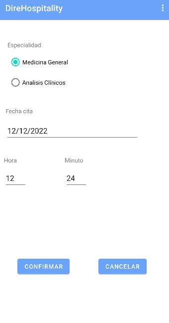

# DireHospitality - App Android

## Descripción

DireHospitality es una aplicación que permite a los pacientes de un hospital/ centro de salud/ consultorio, clínica ... solicitar citas a través de una aplicación instalada en su smartphone.
Los profesionales podrán consultar con su usuario las citas que tiene asignada.

## Imagenes

## Licencia
Este proyecto ha sido realizado por Daniel Rodríguez Fernández, para un proyecto de clase, sin uso comercial alguno.

* **Contacto:** daniel.rodriguezfernandez@alumno.iesluisvives.org
* **Twiter:** [@idanirf](https://twitter.com/idanirf)
* **Linkedin:** [Visita mi perfil](https://www.linkedin.com/in/danielrodriguezfernandez03002/)

